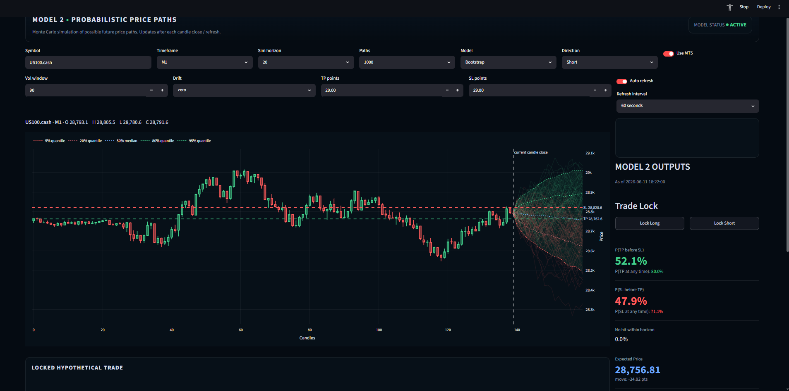
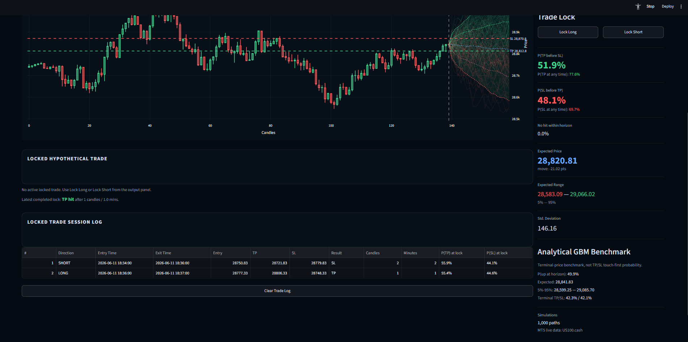

# Probabilistic Price Path Engine

A Python and Streamlit dashboard for live intraday price-path simulation, TP/SL probability estimation, and analytical GBM benchmarking using MetaTrader 5 market data.

The default live symbol for this project is:

```text
US100.cash
```

This project converts a notebook prototype into a clean, modular Python project. The engine estimates the probability of future price paths reaching a take-profit or stop-loss level over a selected simulation horizon.

The dashboard currently supports Monte Carlo GBM simulation, historical bootstrapping, pathwise TP/SL probability estimation, and a closed-form analytical GBM terminal-price benchmark.

---

## Project Overview

The main objective of this project is to build a research-driven market probability engine that can:

- fetch live or recent OHLC data from MetaTrader 5
- estimate recent drift and volatility from candle log returns
- simulate possible future price paths
- calculate whether TP or SL is reached first across simulated paths
- compare Monte Carlo outputs with an analytical GBM terminal distribution
- visualise simulated paths, percentile cones, TP/SL levels, and model outputs
- run as an interactive Streamlit dashboard

This project is not intended to place trades automatically. It is a research and decision-support tool.

---

## Dashboard Preview



## Locked Trade Tracker



## Current Features

### Live/Synthetic Data

The dashboard can either:

- fetch live candle data from MetaTrader 5 for `US100.cash`, or
- use synthetic OHLC data as a fallback when MT5 is unavailable.

### Simulation Models

The current engine supports:

- **GBM Monte Carlo simulation**  
  Simulates future price paths using estimated drift and volatility from recent log returns.

- **Historical bootstrap simulation**  
  Resamples recent historical log returns to generate empirical future paths.

- **Analytical GBM benchmark**  
  Calculates the closed-form GBM terminal distribution as a sanity check against the simulated path outputs.

### TP/SL Probability Engine

The model estimates:

- probability that TP is hit before SL
- probability that SL is hit before TP
- expected terminal price
- expected terminal price range
- terminal price standard deviation
- analytical GBM terminal TP/SL probabilities

The key output is pathwise:

```text
P(TP before SL)
P(SL before TP)
```

This is different from simply asking whether the terminal price finishes above or below a level. The engine checks the order in which TP or SL is touched along each simulated path.

---

## Mathematical Methodology

### Log Returns

The model begins by calculating candle log returns:

$$r_t = \log\left(\frac{S_t}{S_{t-1}}\right)$$

where:

- $S_t$ is the closing price at candle $t$
- $r_t$ is the log return from candle $t-1$ to candle $t$

Recent log returns are used to estimate drift and volatility:

$$\mu = \frac{1}{n}\sum_{t=1}^{n} r_t$$

$$\sigma = \sqrt{\frac{1}{n-1}\sum_{t=1}^{n}(r_t-\mu)^2}$$

The volatility estimate is controlled by a rolling lookback window.

---

## Geometric Brownian Motion Model

The GBM model assumes the price follows the stochastic differential equation:

$$
dS_t = \mu S_t dt + \sigma S_t dW_t
$$

where:

- $S_t$ is the asset price
- $\mu$ is the drift
- $\sigma$ is the volatility
- $W_t$ is Brownian motion

The closed-form solution is:

$$
S_T = S_0 \exp\left(\left(\mu - \frac{1}{2}\sigma^2\right)T + \sigma \sqrt{T} Z\right)
$$

where:

$$Z \sim \mathcal{N}(0,1)$$

In this project, time is measured in candle steps. For example, if the dashboard is running on M1 data and the simulation horizon is 20, then $T = 20$ one-minute candle steps.

The Monte Carlo GBM simulation generates future log-return steps as:

$$\log\left(\frac{S_{t+1}}{S_t}\right) = \left(\mu - \frac{1}{2}\sigma^2\right) + \sigma Z_t$$

and reconstructs the price path using:

$$S_{t+1} = S_t \exp\left(\left(\mu - \frac{1}{2}\sigma^2\right) + \sigma Z_t\right)$$

---

## Analytical GBM Benchmark

The analytical GBM benchmark uses the terminal log-price distribution:

$$\log\left(\frac{S_T}{S_0}\right) \sim \mathcal{N}\left(\left(\mu - \frac{1}{2}\sigma^2\right)T, \sigma^2T\right)$$

Equivalently:

$$\log(S_T) \sim \mathcal{N}\left(\log(S_0) + \left(\mu - \frac{1}{2}\sigma^2\right)T, \sigma^2T\right)$$

This allows the project to calculate closed-form terminal metrics without simulation.

### Expected Terminal Price

Under GBM:

$$\mathbb{E}[S_T] = S_0 e^{\mu T}$$

### Terminal Percentile Range

For a chosen percentile $q$, the terminal price percentile is:

$$S_q = \exp\left(\log(S_0) + \left(\mu - \frac{1}{2}\sigma^2\right)T + z_q\sigma\sqrt{T}\right)$$

where $z_q$ is the $q$-th quantile of the standard normal distribution.

The dashboard uses this to show a 5%-95% analytical GBM terminal range.

### Terminal Probability Above a Level

For a price level $K$:

$$\mathbb{P}(S_T > K) = 1 - \Phi\left(\frac{\log(K/S_0) - \left(\mu - \frac{1}{2}\sigma^2\right)T}{\sigma\sqrt{T}}\right)$$

where $\Phi$ is the standard normal cumulative distribution function.

This is used to estimate terminal probabilities such as:

$$\mathbb{P}(S_T > S_0)$$

$$\mathbb{P}(S_T \text{ beyond TP})$$

$$\mathbb{P}(S_T \text{ beyond SL})$$

Important: these are terminal probabilities. They do not measure whether TP or SL is touched first during the path.

---

## Pathwise TP/SL Probability

Trading outcomes depend on which level is touched first, not only where price finishes at the end of the horizon.

For each simulated path, the engine checks:

- Did the path hit TP first?
- Did the path hit SL first?
- Did neither level get hit within the horizon?

For a long setup:

$$TP = S_0 + \text{TP points}$$

$$SL = S_0 - \text{SL points}$$

For a short setup:

$$TP = S_0 - \text{TP points}$$

$$SL = S_0 + \text{SL points}$$

The main probabilities are estimated as:

$$\mathbb{P}(TP \text{ before } SL) = \frac{\text{number of paths where TP is hit first}}{\text{total number of paths}}$$

$$\mathbb{P}(SL \text{ before } TP) = \frac{\text{number of paths where SL is hit first}}{\text{total number of paths}}$$

This is the core difference between the Monte Carlo pathwise engine and the analytical GBM benchmark.

---

## Historical Bootstrap Model

The bootstrap model does not assume normally distributed returns.

Instead, it samples from recent empirical log returns:

$$
r_t^* \sim \text{sample}\left\{r_1,r_2,\ldots,r_n\right\}
$$

and constructs future paths using:

$$S_{t+1} = S_t e^{r_t^*}$$

This allows the model to preserve some of the recent empirical behaviour of the market, including non-Gaussian features such as skew, fat tails, or clustered volatility.

---

## Project Structure

```text
probabilistic-price-path-engine/
├── app/
│   └── streamlit_app.py
├── notebooks/
├── src/
│   ├── __init__.py
│   ├── mt5_loader.py
│   ├── simulator.py
│   ├── probability_engine.py
│   ├── charts.py
│   └── utils.py
│   ├── data_loader.py
├── data/
│   └── historical/
├── reports/
│   ├── logs/
│   └── figures/
├── live_artifacts/
│   └── states/
├── requirements.txt
├── .gitignore
└── README.md
```

---

## Main Modules

### `src/mt5_loader.py`

Handles:

- MT5 connection
- candle fetching
- synthetic OHLC fallback generation

### `src/simulator.py`

Handles:

- log-return calculation
- drift and volatility estimation
- GBM path simulation
- historical bootstrap path simulation

### `src/probability_engine.py`

Handles:

- TP-before-SL pathwise probability estimation
- expected terminal range
- terminal up/down probabilities
- analytical GBM terminal metrics

### `src/charts.py`

Handles:

- recent candlestick chart
- future simulated path visualisation
- percentile cone plotting
- TP and SL level display

### `app/streamlit_app.py`

Runs the interactive Streamlit dashboard.

### `src/data_loader.py`

Handles:

- universal data-source loading interface
- OHLC schema validation
- MT5, CSV, and synthetic data routing

---

## How to Run the Project

### 1. Clone the repository

```bash
git clone https://github.com/MichaelMorgante/probabilistic-price-path-engine.git
cd probabilistic-price-path-engine
```

### 2. Create a virtual environment

On Windows PowerShell:

```powershell
python -m venv .venv
.\.venv\Scripts\Activate.ps1
```

If PowerShell blocks activation, run:

```powershell
Set-ExecutionPolicy -ExecutionPolicy RemoteSigned -Scope CurrentUser
```

Then activate again:

```powershell
.\.venv\Scripts\Activate.ps1
```

### 3. Install requirements

```powershell
python -m pip install --upgrade pip
pip install -r requirements.txt
```

### 4. Run the Streamlit dashboard

```powershell
streamlit run app\streamlit_app.py
```

The app should open in your browser automatically.

---

## MetaTrader 5 Notes

To use live MT5 data:

1. MetaTrader 5 must be installed.
2. MT5 must be open and logged in.
3. The default project symbol is `US100.cash`.
4. The dashboard symbol must match the broker symbol exactly.

If your broker uses a different symbol name for Nasdaq/US100, change the symbol field in the dashboard.

If MT5 is unavailable or the symbol cannot be loaded, the dashboard can fall back to synthetic data.

---

## Current Development Status

This project is currently in active development.

Completed:

- clean Python project structure
- Streamlit dashboard
- MT5 candle loading for `US100.cash`
- synthetic data fallback
- universal data-source loader interface
- CSV, MT5, and synthetic data routing
- GBM Monte Carlo simulation
- historical bootstrap simulation
- analytical GBM terminal benchmark
- pathwise TP/SL probability engine
- any-time TP/SL touch probabilities
- no-hit-within-horizon probability
- configurable simulation controls
- configurable refresh interval
- MT5 candle-close refresh mode
- closed-candle MT5 model calculations
- TP/SL price labels on the chart
- clearer quantile labelling
- locked hypothetical trade mode
- locked trade hit detection
- session-based locked trade log
- README methodology section with typeset GBM equations
- dashboard screenshots
- first research notebook
- jump-diffusion research notebook
- data-source loader interface
- first price-path research notebook
- jump-diffusion sensitivity analysis
- signed jump analysis

Planned improvements:
- regime-adjusted bootstrap model
- fuller validation comparing GBM, bootstrap, jump-diffusion, and analytical GBM
- optional MT5 bid/ask-based locked entry
- improved locked trade card layout
- possible integration with VWAP probability-band context

---

## Important Disclaimer

This project is for research, education, and personal analysis only.

It does not provide financial advice, trade recommendations, or guaranteed predictions. Simulated probabilities are model-based estimates and can be wrong. Financial markets are uncertain, and live trading involves risk.